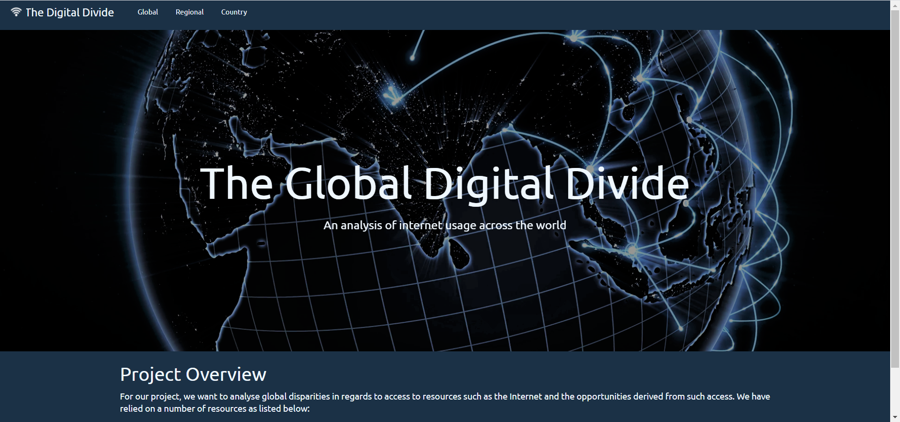
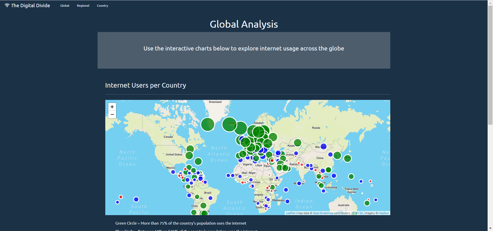
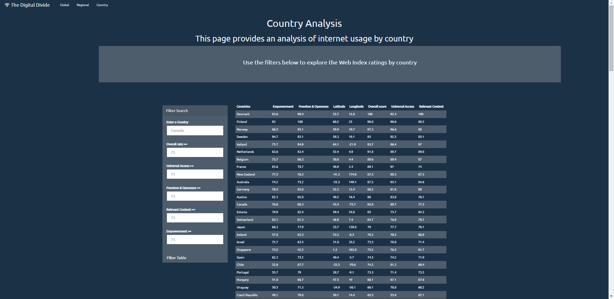

# **Global Digital Divide Project 2**

In this assignment, the objective is to create an end-to-end ETL (Extract, Transform, Load) process.
All data will be rendered on a website using charts, maps and tables.
See more details in the requirements/specifications section below.

  

  

## **1. Authors**

This project was created and authored by:
* **Anna Wrobel**
* **Latyr Thiao**
* **Lujane Abdelgadir**
* **Prajakta Galvankar**
* **Stephen Zhang**

## **2. Requirements / Specifications**

The business & technical requirements that must be met by the solution:
* [Project 2](01_Project2.pdf)
* [Diagram](01_Diagram.pdf)

## **3. Prerequisites**

The mandatory steps to be taken to make the code work smoothly.

### **3.1 License & Key**

You must have set up a password to connect to a database. See details [here](03_User_Guide_v0.3.docx).

### **3.2 Installing**

The assumption here is that your computer is running on Windows 10.
Feel free to adjust if you are using a Mac OS or any other operating system.

What software do you need and how to install them?

* Jupyter Notebook
* All Python modules required to run the process. See details [here](03_User_Guide_v0.3.docx).
* Any web browser (Chrome, ...) 
* Anaconda/Python terminal
* Any IDE that enable to write or read code (VS Code, ...)

## **4. Tools & Coding Languages**

The following tools and coding languages were used:
* HTML
* JavaScript
* Css
* Flask
* pgAdmin (SQL)

## **5. Data Source(s)**

The data used as input is coming from the following sources:
* World bank API: https://datahelpdesk.worldbank.org/knowledgebase/articles/898581-api-basic-call-structures
* Web index: https://thewebindex.org/downloads/
* Compare the market: https://www.comparethemarket.com/broadband/content/global-broadband-index/
* Internet World Stats: https://www.internetworldstats.com/stats1.html

NOTE: The data sources websites may have evolved, causing the scrping and Jupyter Notebook not to work a year after this project. 

## **6. Run the code**

### **Step 1: The code is located here**
Follow [this documentation](03_User_Guide_v0.3.docx) to see what code to run.
Subsequent code, e.g. the destination html page to open after the index page, is available but not described in the documentation.

### **Step 2: Extract all files & run the code**
* Download this entire project from Github
* Open VS Code or your IDE
* Choose 'File > Open Folder'
* Select the path to the folder located 1 level above the folder where the [HTML](index.html) is located. 
    * Example if your index file is located: Documents/.../Folder_Level_1_Above/17_Global_Digital_Divide_Project_2
    * Select: Folder_Level_1_Above
* Right click the folder that contains your [HTML](index.html), it should be named: 17_Global_Digital_Divide_Project_2
* Select: Open in integrated terminal
* It should open the terminal
* In the terminal do the following:
    * Type the command 'conda activate Your_Environment_Name'
    * Your_Environment_Name is the name of your Python environment you defined
    * Run the server by typing the following: 'Python -m http.server'
    * Then, copy/paste this url [localhost](http://localhost:8000/) into your browser and press enter
* The page should load the welcome page and you can navigate to show the desired information
* Don't forget to shut down the server by closing your Python terminal in VS Code

## **7. User Acceptance Testing**

See related documentation to learn more about acceptence criteria:  
* [Project 2](01_Project2.pdf)
* [Diagram](01_Diagram.pdf)

## **8. Deployment**

* You could also deploy this entire folder with your preferred service provider (Github, ...) where a website can be hosted
* See [how to host a website on Github](https://www.youtube.com/watch?v=M5mg0r4ajt4&list=TLPQMTgwODIwMjFMJ3NIh8pJ7w&index=2)

## **9. Expected result**

NOTE: The data sources websites may have evolved, causing the scrping and Jupyter Notebook not to work a year after this project.

* [Documentation](03_User_Guide_v0.3.docx)
* [Presentation](04_Presentation.pdf)

The outcome should be similar to the below:

  

 

  

 

  

  

